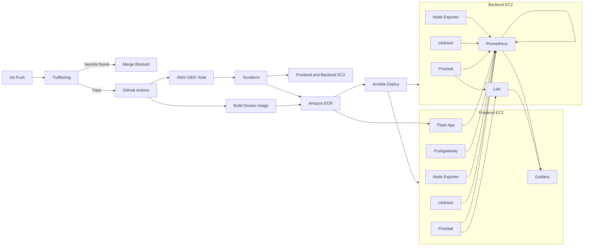

# Terraform Grafana Monitoring Stack

A complete AWS-based CI/CD and observability project that provisions infrastructure with Terraform, deploys services with Ansible, builds and publishes a Dockerized Flask application, monitors hosts and containers with Prometheus, visualizes metrics and logs in Grafana, and supports z/OS seed-library automation.

## What This Project Demonstrates

- Infrastructure as Code with Terraform
- Configuration management with Ansible
- Docker image builds and Amazon ECR publishing
- GitHub Actions CI/CD
- AWS authentication through GitHub OIDC
- Secret scanning with TruffleHog
- Dynamic EC2 inventory
- Metrics collection with Prometheus
- Log aggregation with Promtail and Loki
- Dashboard provisioning with Grafana
- Short-lived job metrics with Pushgateway
- Host metrics with Node Exporter
- Container metrics with cAdvisor
- z/OS seed-library synchronization using IBM Ansible collections

## Architecture



## Deployed Components

| Component | Purpose | Default port |
|---|---|---:|
| Flask application | Demo web application and custom Prometheus metrics | `5000` |
| Grafana | Metrics and log visualization | `3000` |
| Prometheus | Metrics collection and querying | `9090` |
| Pushgateway | Metrics from short-lived jobs | `9091` |
| Loki | Central log storage and querying | `3100` |
| Promtail | Host and Docker log collection | `9080` |
| Node Exporter | EC2 host metrics | `9100` |
| cAdvisor | Docker container metrics | `8080` |

## Repository Structure

```text
.
├── .github/workflows/
│   ├── ansible-lint.yml
│   ├── ansible.yml
│   ├── docker-app-deploy.yml
│   ├── terraform.yml
│   ├── trufflehog.yml
│   └── zos-seed-libraries.yml
├── ansible/
│   ├── inventory/
│   │   └── aws_ec2.yml
│   ├── playbooks/
│   │   ├── backend.yml
│   │   ├── deploy_docker_app.yml
│   │   ├── endpoints.yml
│   │   ├── frontend.yml
│   │   ├── install_docker.yml
│   │   └── site.yml
│   ├── templates/
│   │   ├── grafana/
│   │   ├── prometheus.yml.j2
│   │   └── promtail-config.yml.j2
│   ├── ansible.cfg
│   └── requirements.yml
├── app/
│   ├── Dockerfile
│   ├── app.py
│   ├── db.py
│   ├── worker.py
│   ├── requirements.txt
│   ├── templates/
│   ├── static/
│   └── test_*.py
├── terraform/
│   ├── ec2.tf
│   ├── ecr.tf
│   └── main.tf
├── terraform-end-user/
├── zos-ansible/
├── Makefile
└── README.md
```

## Application Metrics

The Flask application exposes:

```text
GET /health
GET /metrics
```

Custom Prometheus metrics include:

- `flask_http_requests_total`
- `flask_http_request_duration_seconds`
- `flask_http_requests_in_progress`
- `employee_users_created_total`
- `employee_user_creation_failures_total`
- `employee_worker_starts_total`
- `employee_provisioning_status`

Prometheus also collects:

- EC2 CPU, memory, filesystem, and network metrics through Node Exporter
- Docker CPU, memory, network, and container-state metrics through cAdvisor
- Prometheus, Loki, Promtail, and Pushgateway internal metrics
- Short-lived automation metrics pushed to Pushgateway

## GitHub Actions

### `trufflehog.yml`

Scans repository history for verified or unknown secrets using TruffleHog.

The workflow checks out the full Git history and can prevent unsafe changes from being merged.

### `ansible-lint.yml`

Runs `ansible-lint` for pull requests targeting supported branches.

It installs the Ansible collections listed in:

```text
ansible/requirements.yml
```

### `terraform.yml`

A manually triggered Terraform workflow with these actions:

- `plan`
- `apply`
- `destroy`

It performs:

1. AWS credential and permission checks
2. Terraform initialization
3. Formatting validation
4. Terraform validation
5. Plan, apply, or destroy based on the selected input

### `ansible.yml`

Manually deploys the complete monitoring stack.

It:

1. Installs Ansible, boto3, botocore, and required collections
2. Retrieves the EC2 SSH private key from AWS Systems Manager Parameter Store
3. Loads the AWS EC2 dynamic inventory
4. Verifies frontend and backend groups
5. Tests SSH connectivity
6. Runs `ansible/playbooks/site.yml`

### `docker-app-deploy.yml`

Automatically runs for relevant changes pushed to `main`, and can also be started manually.

The workflow has three main stages:

1. **Terraform infrastructure**
   - Assumes the AWS deployment role through GitHub OIDC
   - Initializes the remote Terraform backend
   - Applies the infrastructure

2. **Docker build and publish**
   - Builds the Flask application image
   - Tags it with the commit SHA and `latest`
   - Pushes both tags to Amazon ECR
   - Enables ECR image scanning

3. **Ansible application deployment**
   - Retrieves the EC2 SSH key from SSM Parameter Store
   - Discovers the frontend EC2 instance dynamically
   - Logs the server into ECR
   - Deploys the image using `deploy_docker_app.yml`

### `zos-seed-libraries.yml`

Synchronizes z/OS seed libraries using Ansible and `ibm.ibm_zos_core`.

It installs the pinned Ansible and IBM collection versions, creates the z/OS SSH key from a GitHub secret, and runs the z/OS library synchronization playbooks.

## GitHub Secrets

> GitHub does not expose secret values through the repository. Only the secret names referenced by workflow files can be documented.

The current workflows reference the following secrets:

| Secret | Used for |
|---|---|
| `AWS_DEFAULT_REGION` | AWS deployment region and Terraform variable |
| `AWS_ACCESS_KEY_ID` | AWS authentication for older or manual workflows |
| `AWS_SECRET_ACCESS_KEY` | AWS authentication for older or manual workflows |
| `TF_STATE_BUCKET` | Terraform remote-state S3 bucket used by `terraform.yml` |
| `DATABASE_URL` | Database connection passed to the Flask application |
| `ID_RSA` | z/OS SSH key referenced by the Docker deployment workflow |
| `ZOS_SSH_PRIVATE_KEY` | z/OS SSH key used by the seed-library workflow |

The main Docker deployment workflow uses GitHub OIDC and assumes:

```text
arn:aws:iam::699475916440:role/team02-actions-deploy
```

OIDC avoids storing long-lived AWS access keys for that workflow.

## AWS Resources

Terraform provisions and manages resources used by the monitoring environment, including:

- Frontend EC2 instance
- Backend EC2 instance
- Security groups
- Networking required by the instances
- EC2 SSH key material
- Secure SSH private-key storage in SSM Parameter Store
- Amazon ECR repository for the application image
- Project and role tags used by Ansible dynamic inventory

The private EC2 SSH key is retrieved at deployment time from:

```text
/monitoring/ssh-private-key
```

The Docker deployment workflow initializes Terraform with:

```text
S3 bucket: ssc59-terraform-monitoring-state
State key: monitoring/terraform.tfstate
Backend region: us-east-1
```

The application and monitoring infrastructure are deployed in:

```text
us-west-1
```

## Ansible Deployment

The AWS EC2 dynamic inventory discovers instances using tags instead of hardcoded IP addresses.

Expected inventory groups:

```text
frontend
backend
```

Run the complete monitoring deployment:

```bash
cd ansible
ansible-inventory -i inventory/aws_ec2.yml --graph
ansible all -m ping
ansible-playbook playbooks/site.yml
```

Run individual parts:

```bash
ansible-playbook playbooks/install_docker.yml
ansible-playbook playbooks/backend.yml
ansible-playbook playbooks/frontend.yml
ansible-playbook playbooks/endpoints.yml
```

Deploy only the Flask application image:

```bash
ansible-playbook playbooks/deploy_docker_app.yml
```

## Monitoring Data Flow

### Metrics

```text
Flask App ─────────────┐
Node Exporter ─────────┤
cAdvisor ──────────────┤
Promtail ──────────────┤
Loki ──────────────────┤
Pushgateway ───────────┤
Prometheus self-scrape ├──> Prometheus ───> Grafana
```

### Logs

```text
Docker and system logs
          │
          ▼
       Promtail
          │
          ▼
         Loki
          │
          ▼
        Grafana
```

### Short-lived Job Metrics

```text
GitHub Actions / Terraform / Ansible / z/OS jobs
                         │
                         ▼
                    Pushgateway
                         │
                         ▼
                    Prometheus
                         │
                         ▼
                      Grafana
```

Pushgateway does not automatically create custom metrics. A job must explicitly push a metric into it.

Example:

```bash
echo 'repository_deployment_success 1' |
  curl --data-binary @- \
  http://<frontend-ip>:9091/metrics/job/terraform_grafana_stack
```

## Service Access

Use the current Terraform outputs or EC2 public IP addresses.

| Service | URL |
|---|---|
| Grafana | `http://<frontend-public-ip>:3000` |
| Flask application | `http://<frontend-public-ip>:5000` |
| Flask health endpoint | `http://<frontend-public-ip>:5000/health` |
| Flask metrics endpoint | `http://<frontend-public-ip>:5000/metrics` |
| Pushgateway | `http://<frontend-public-ip>:9091` |
| Frontend cAdvisor | `http://<frontend-public-ip>:8080` |
| Frontend Promtail | `http://<frontend-public-ip>:9080/metrics` |
| Frontend Node Exporter | `http://<frontend-public-ip>:9100/metrics` |
| Prometheus | `http://<backend-public-ip>:9090` |
| Prometheus targets | `http://<backend-public-ip>:9090/targets` |
| Loki readiness endpoint | `http://<backend-public-ip>:3100/ready` |
| Backend cAdvisor | `http://<backend-public-ip>:8080` |
| Backend Promtail | `http://<backend-public-ip>:9080/metrics` |
| Backend Node Exporter | `http://<backend-public-ip>:9100/metrics` |

Some ports may only be reachable from inside the VPC or from security-group-approved sources.

## Grafana

Grafana is provisioned with Prometheus and Loki data sources.

The dashboard includes:

- EC2 CPU and memory
- Container CPU and memory
- Flask application metrics
- Prometheus target health
- Docker and infrastructure logs

Default lab credentials:

```text
Username: admin
Password: admin
```

Change the password for any environment that is accessible beyond a temporary lab.

## Verifying the Stack

### Check Prometheus Targets

Open:

```text
http://<backend-public-ip>:9090/targets
```

All configured targets should report:

```text
UP
```

### Check Loki Labels

```bash
curl -s http://<backend-ip>:3100/loki/api/v1/labels
```

Expected labels include:

```text
container
filename
host
job
stream
```

### Query Docker Logs

```bash
curl -G -s http://<backend-ip>:3100/loki/api/v1/query_range \
  --data-urlencode 'query={job="docker"}' \
  --data-urlencode 'limit=5'
```

Example Grafana LogQL queries:

```logql
{job=~"docker|system"}
```

```logql
{job="docker", container="terraform-docker-app"}
```

### Verify Pushgateway

Push a test metric:

```bash
echo 'repository_deployment_success 1' |
  curl --data-binary @- \
  http://<frontend-ip>:9091/metrics/job/terraform_grafana_stack
```

Verify the metric:

```bash
curl -s http://<frontend-ip>:9091/metrics |
  grep repository_deployment_success
```

Query it in Prometheus:

```promql
repository_deployment_success
```

## Local Application Development

Build the application image:

```bash
docker build -f app/Dockerfile -t terraform-docker-app .
```

Run it:

```bash
docker run --rm \
  -p 5000:5000 \
  -e DATABASE_URL="$DATABASE_URL" \
  terraform-docker-app
```

Test the application:

```bash
curl http://localhost:5000/health
curl http://localhost:5000/metrics
```

## Makefile

The root `Makefile` provides shortcuts for infrastructure and deployment tasks.

Review available targets:

```bash
make help
```

Typical workflow:

```bash
make init
make plan
make apply
make fetch-key
make deploy
```

Destroy the Terraform-managed infrastructure:

```bash
make destroy
```

## Security

- TruffleHog scans commits for exposed credentials.
- The main deployment workflow uses GitHub OIDC instead of static AWS access keys.
- The EC2 private key is stored as an encrypted SSM SecureString.
- ECR image scanning is enabled for the application repository.
- `.pem` files, passwords, Terraform state files, and `.tfvars` files should never be committed.
- Grafana, Prometheus, application, and exporter ports should be restricted with AWS security groups.
- Default Grafana credentials should be replaced.
- The GitHub Actions IAM role should use least-privilege permissions.

## Teardown

Use the Terraform GitHub Actions workflow and select:

```text
destroy
```

Or run locally:

```bash
make destroy
```

This removes Terraform-managed infrastructure.

Resources created outside Terraform, such as the IAM OIDC role, S3 state bucket, or GitHub secrets, must be removed separately.

## Technology Stack

- AWS EC2
- AWS ECR
- AWS IAM
- GitHub OIDC
- AWS Systems Manager Parameter Store
- AWS S3
- Terraform
- Ansible
- Docker
- Flask
- Prometheus
- Grafana
- Loki
- Promtail
- Pushgateway
- Node Exporter
- cAdvisor
- GitHub Actions
- TruffleHog
- IBM z/OS Ansible collections
